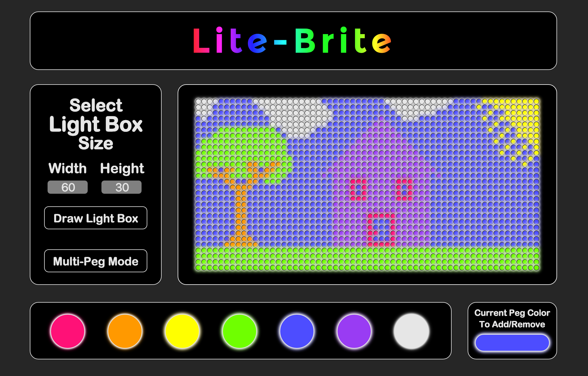
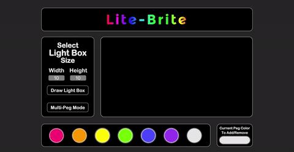
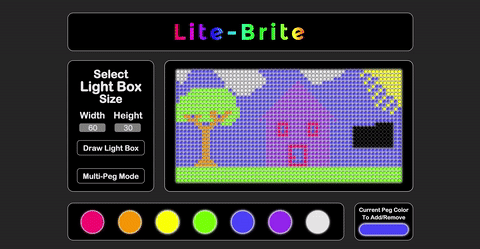
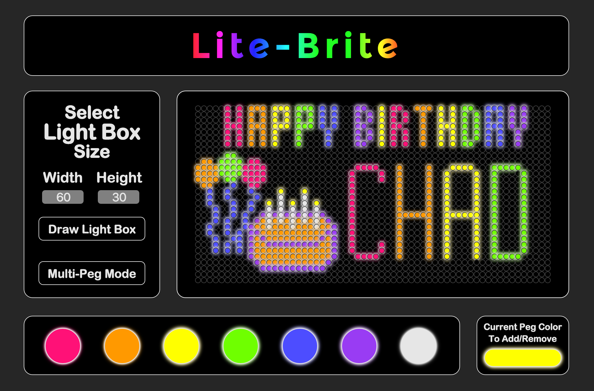

# Pixel Art Maker

This was an exercise in creating my own pixel art maker with the goal of allowing a user to choose colors from a palette and then paint pixel art. The interface was completely up to me so I decided to go with something old school and recreate the [Lite-Brite] (https://en.wikipedia.org/wiki/Lite-Brite). I was always jealous of my friends who had a Lite-Brite when I was a kid so this was my chance to make my own. 

You can try out the application for yourself by clicking [here](http://jakebrbell-pixel-art-maker.surge.sh/).

##Features

The basic features of the application allow a user to select a color from a palette of colors and then paint that color onto the canvas. They can then remove pegs by clicking on pegs that match the currently selected color. 

The advanced features allow the user to customize the size of the grid:

The user is also able to turn on "Multi-Peg Mode" so they can click and drag and drop multiple pegs as they go:

##Tech

* HTML/CSS
* JavaScript
* Google Fonts
* Surge (for deployment)

##Continued development

In the future I would like to add the ability for a user to save their work and export their final product so they could make designs and share them with their friends.

